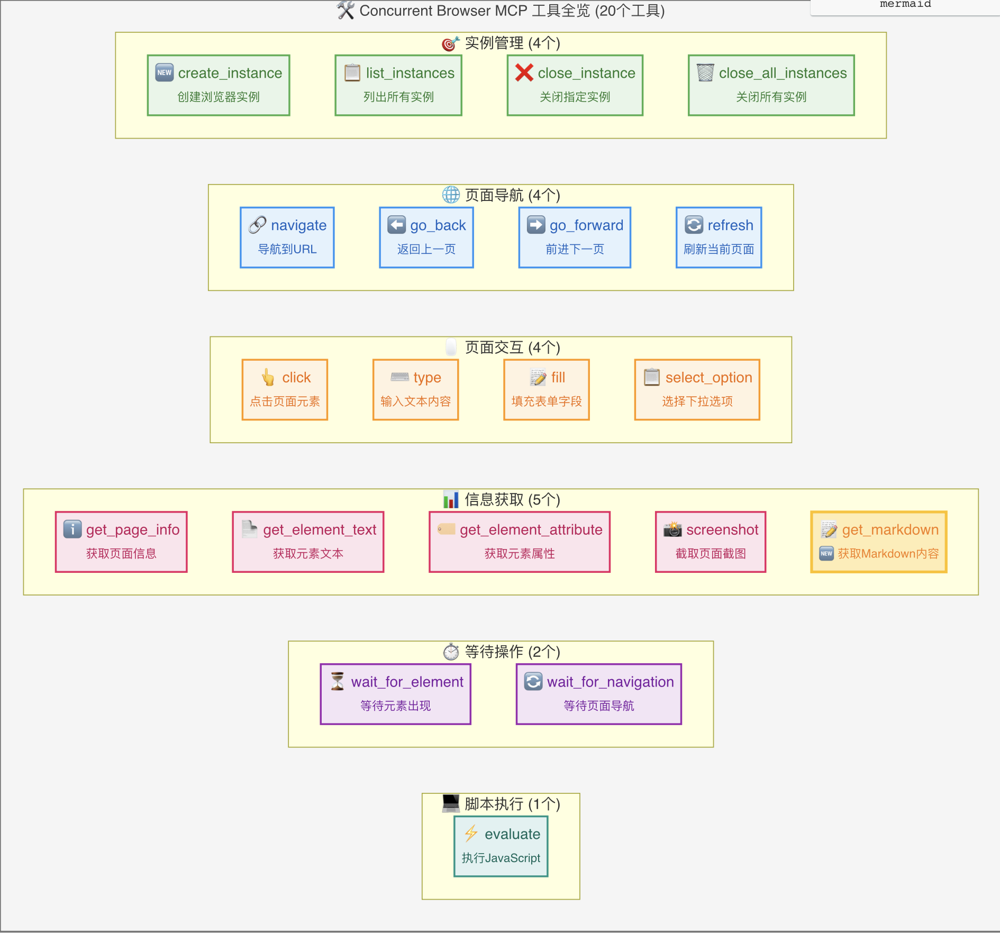

# Concurrent Browser MCP

一个支持多并发的浏览器 MCP (Model Context Protocol) 服务器，基于 Playwright 构建。

**中文** | [English](README.md)

## 功能特点

- 🚀 **多实例并发**: 支持同时运行多个浏览器实例
- 🎯 **实例管理**: 动态创建、管理和清理浏览器实例
- 🔧 **灵活配置**: 支持多种浏览器类型和自定义配置
- 🛡️ **资源管理**: 自动清理超时的实例，防止资源泄漏
- 🌐 **全功能支持**: 完整的浏览器自动化功能（导航、点击、输入、截图等）
- 💻 **跨平台**: 支持 Chromium、Firefox、WebKit

## 安装

### 方式一：从 npm 安装（推荐）

```bash
# 全局安装
npm install -g concurrent-browser-mcp

# 或者直接使用 npx（无需安装）
npx concurrent-browser-mcp
```

### 方式二：从源码构建

```bash
# 克隆仓库
git clone https://github.com/sailaoda/concurrent-browser-mcp.git
cd concurrent-browser-mcp

# 安装依赖
npm install

# 构建项目
npm run build

# 可选：全局链接（用于本地开发）
npm link
```

### 方式三：快速安装脚本

```bash
git clone https://github.com/sailaoda/concurrent-browser-mcp.git
cd concurrent-browser-mcp
./install.sh
```

## 快速开始

### 1. 基础用法

```bash
# 启动服务器（默认配置）
npx concurrent-browser-mcp

# 自定义配置
npx concurrent-browser-mcp --max-instances 25 --browser firefox --headless false
```

### 2. MCP 客户端配置

根据您的安装方式选择相应的配置：

#### 使用 npm 全局安装或 npx

```json
{
  "mcpServers": {
    "concurrent-browser": {
      "command": "npx",
      "args": ["concurrent-browser-mcp", "--max-instances", "20"]
    }
  }
}
```

#### 使用全局安装版本

```json
{
  "mcpServers": {
    "concurrent-browser": {
      "command": "concurrent-browser-mcp",
      "args": ["--max-instances", "20"]
    }
  }
}
```

#### 使用本地构建版本

如果您从源码构建，可以直接引用本地构建的版本：

```json
{
  "mcpServers": {
    "concurrent-browser": {
      "command": "node",
      "args": ["/path/to/concurrent-browser-mcp/dist/index.js", "--max-instances", "20"],
      "cwd": "/path/to/concurrent-browser-mcp"
    }
  }
}
```

或者使用相对路径（如果配置文件和项目在同一目录层级）：

```json
{
  "mcpServers": {
    "concurrent-browser": {
      "command": "node",
      "args": ["./concurrent-browser-mcp/dist/index.js", "--max-instances", "20"]
    }
  }
}
```

#### 使用 npm link 版本（开发模式）

如果您使用了 `npm link`：

```json
{
  "mcpServers": {
    "concurrent-browser": {
      "command": "concurrent-browser-mcp",
      "args": ["--max-instances", "20"]
    }
  }
}
```

## 命令行选项

| 选项 | 描述 | 默认值 |
|------|------|--------|
| `-m, --max-instances <number>` | 最大实例数 | 20 |
| `-t, --instance-timeout <number>` | 实例超时时间（分钟） | 30 |
| `-c, --cleanup-interval <number>` | 清理间隔（分钟） | 5 |
| `--browser <browser>` | 默认浏览器类型 (chromium/firefox/webkit) | chromium |
| `--headless` | 默认无头模式 | true |
| `--width <number>` | 默认视口宽度 | 1280 |
| `--height <number>` | 默认视口高度 | 720 |
| `--user-agent <string>` | 默认用户代理 | - |
| `--proxy <string>` | 代理服务器地址 (例如: http://127.0.0.1:7890) | - |
| `--no-proxy-auto-detect` | 禁用代理自动检测 | false |
| `--ignore-https-errors` | 忽略 HTTPS 错误 | false |
| `--bypass-csp` | 绕过 CSP | false |

## 代理配置

concurrent-browser-mcp 支持灵活的代理配置，帮助您在需要代理的网络环境中正常使用浏览器自动化功能。

### 代理配置方式

#### 1. 命令行指定代理
```bash
# 使用指定的代理服务器
npx concurrent-browser-mcp --proxy http://127.0.0.1:7890
```

#### 2. 自动检测本地代理（默认启用）
系统会自动按以下顺序检测代理：
- **环境变量**: `HTTP_PROXY`, `HTTPS_PROXY`, `ALL_PROXY`
- **常见代理端口**: 7890, 1087, 8080, 3128, 8888, 10809, 20171
- **系统代理设置** (macOS): 自动读取系统网络设置

```bash
# 默认启用自动检测（无需额外参数）
npx concurrent-browser-mcp

# 明确禁用自动检测
npx concurrent-browser-mcp --no-proxy-auto-detect
```

#### 3. MCP 配置文件中的代理设置

**使用指定代理：**
```json
{
  "mcpServers": {
    "concurrent-browser": {
      "command": "npx",
      "args": ["concurrent-browser-mcp", "--proxy", "http://127.0.0.1:7890"]
    }
  }
}
```

**禁用代理：**
```json
{
  "mcpServers": {
    "concurrent-browser": {
      "command": "npx", 
      "args": ["concurrent-browser-mcp", "--no-proxy-auto-detect"]
    }
  }
}
```

### 代理检测日志
启动时会显示代理检测结果：
```
🚀 Starting Concurrent Browser MCP Server...
Max instances: 20
Default browser: chromium
Headless mode: yes
Viewport size: 1280x720
Instance timeout: 30 minutes
Cleanup interval: 5 minutes
Proxy: Auto-detection enabled  # 或显示检测到的代理地址
```

### 支持的代理类型
- HTTP 代理：`http://proxy-server:port`
- HTTPS 代理：`https://proxy-server:port`
- SOCKS5 代理：`socks5://proxy-server:port`

### 注意事项
- 代理配置会应用到所有创建的浏览器实例
- 不支持需要用户名密码认证的代理
- 可以通过环境变量设置代理，无需手动配置
- 代理检测会在服务启动时自动完成，不影响运行性能

## 可用工具



### 实例管理

- `browser_create_instance`: 创建新的浏览器实例
- `browser_list_instances`: 列出所有实例
- `browser_close_instance`: 关闭指定实例
- `browser_close_all_instances`: 关闭所有实例

### 页面导航

- `browser_navigate`: 导航到指定URL
- `browser_go_back`: 返回上一页
- `browser_go_forward`: 前进到下一页
- `browser_refresh`: 刷新当前页面

### 页面交互

- `browser_click`: 点击页面元素
- `browser_type`: 在元素中输入文本
- `browser_fill`: 填充表单字段
- `browser_select_option`: 选择下拉选项

### 页面信息

- `browser_get_page_info`: 获取页面信息
- `browser_get_element_text`: 获取元素文本
- `browser_get_element_attribute`: 获取元素属性
- `browser_screenshot`: 截取页面截图
- `browser_get_markdown`: 获取Markdown内容

### 等待操作

- `browser_wait_for_element`: 等待元素出现
- `browser_wait_for_navigation`: 等待页面导航完成

### JavaScript 执行

- `browser_evaluate`: 执行 JavaScript 代码

## 使用示例

### 1. 创建浏览器实例

```javascript
// 创建一个新的 Chrome 实例
await callTool('browser_create_instance', {
  browserType: 'chromium',
  headless: false,
  viewport: { width: 1920, height: 1080 },
  metadata: {
    name: 'main-browser',
    description: '主要浏览器实例'
  }
});
```

### 2. 导航和交互

```javascript
// 导航到网站
await callTool('browser_navigate', {
  instanceId: 'your-instance-id',
  url: 'https://example.com'
});

// 点击按钮
await callTool('browser_click', {
  instanceId: 'your-instance-id',
  selector: '#submit-button'
});

// 输入文本
await callTool('browser_type', {
  instanceId: 'your-instance-id',
  selector: '#username',
  text: 'myusername'
});
```

### 3. 截图和信息获取

```javascript
// 截取页面截图
await callTool('browser_screenshot', {
  instanceId: 'your-instance-id',
  fullPage: true,
  type: 'png'
});

// 获取页面信息
await callTool('browser_get_page_info', {
  instanceId: 'your-instance-id'
});
```

### 4. 并发操作

```javascript
// 创建多个实例并行处理
const instances = await Promise.all([
  callTool('browser_create_instance', { metadata: { name: 'worker-1' } }),
  callTool('browser_create_instance', { metadata: { name: 'worker-2' } }),
  callTool('browser_create_instance', { metadata: { name: 'worker-3' } })
]);

// 并行导航到不同的页面
await Promise.all(instances.map(async (instance, index) => {
  await callTool('browser_navigate', {
    instanceId: instance.data.instanceId,
    url: `https://example${index + 1}.com`
  });
}));
```

## 架构设计

```
┌─────────────────────────────────────────────────────────────────┐
│                         MCP Client                              │
├─────────────────────────────────────────────────────────────────┤
│                    Concurrent Browser MCP Server                │
│  ┌─────────────────┐  ┌─────────────────┐  ┌─────────────────┐  │
│  │  Browser Tools  │  │ Browser Manager │  │  MCP Server     │  │
│  │                 │  │                 │  │                 │  │
│  │ - Tool Defs     │  │ - Instance Mgmt │  │ - Request       │  │
│  │ - Execution     │  │ - Lifecycle     │  │   Handling      │  │
│  │ - Validation    │  │ - Cleanup       │  │ - Error Mgmt    │  │
│  └─────────────────┘  └─────────────────┘  └─────────────────┘  │
├─────────────────────────────────────────────────────────────────┤
│                        Playwright                              │
│  ┌─────────────────┐  ┌─────────────────┐  ┌─────────────────┐  │
│  │   Browser 1     │  │   Browser 2     │  │   Browser N     │  │
│  │   (Chromium)    │  │   (Firefox)     │  │   (WebKit)      │  │
│  └─────────────────┘  └─────────────────┘  └─────────────────┘  │
└─────────────────────────────────────────────────────────────────┘
```

## 真实功能测试

除了模拟演示脚本，我们还提供了真实的浏览器功能测试脚本，让您可以看到实际的截图效果：

### 🧪 运行真实测试

```bash
# 运行真实浏览器截图测试
node test-real-screenshot.js
```

这个测试脚本会：

1. **启动真实浏览器**: 使用 Chromium 引擎
2. **访问网站**: 导航到 example.com 和 github.com
3. **截图保存**: 生成真实的 PNG 截图文件
4. **文件输出**: 在当前目录生成截图文件

### 📸 测试输出示例

```
🚀 启动真实浏览器截图测试...
✅ 浏览器已启动
✅ 页面已创建
🌐 正在导航到 https://example.com...
✅ 页面加载完成
📸 正在截图并保存为 screenshot-2025-07-19T11-04-18-660Z.png...
✅ 截图已保存: screenshot-2025-07-19T11-04-18-660Z.png
📊 文件大小: 23.57 KB
📂 文件位置: /path/to/screenshot-2025-07-19T11-04-18-660Z.png
🌐 正在访问 https://github.com...
✅ github 截图已保存: screenshot-github-2025-07-19T11-04-18-660Z.png (265.99 KB)
🛑 浏览器已关闭
```

### 🖼️ 查看截图文件

测试完成后，您可以在项目目录中找到实际的截图文件：

```bash
# 查看生成的截图文件
ls -la screenshot-*.png

# 在系统默认图片查看器中打开
open screenshot-*.png    # macOS
start screenshot-*.png   # Windows
xdg-open screenshot-*.png # Linux
```

## 与传统 MCP 浏览器服务器的区别

| 特性 | 传统 MCP 浏览器服务器 | Concurrent Browser MCP |
|------|---------------------|----------------------|
| 实例管理 | 单实例 | 多实例并发 |
| 资源隔离 | 无 | 完全隔离 |
| 并发处理 | 串行 | 并行 |
| 实例生命周期 | 手动管理 | 自动管理 |
| 资源清理 | 手动 | 自动 |
| 可扩展性 | 有限 | 高度可扩展 |

## 开发指南

### 本地开发环境搭建

```bash
# 1. 克隆项目
git clone https://github.com/sailaoda/concurrent-browser-mcp.git
cd concurrent-browser-mcp

# 2. 安装依赖
npm install

# 3. 构建项目
npm run build

# 4. 本地链接（可选，用于全局命令测试）
npm link
```

### 可用的 npm 脚本

```bash
# 构建 TypeScript 项目
npm run build

# 开发模式（文件监听）
npm run dev

# 运行代码检查
npm run lint

# 修复代码格式问题
npm run lint:fix

# 清理构建产物
npm run clean

# 运行测试
npm test
```

### 项目结构

```
concurrent-browser-mcp/
├── src/                    # 源代码目录
│   ├── index.ts           # CLI 入口
│   ├── server.ts          # MCP 服务器主逻辑
│   ├── browser-manager.ts # 浏览器实例管理器
│   └── tools.ts           # MCP 工具定义和实现
├── dist/                  # 构建产物目录
├── assets/                # 静态资源目录
├── examples/              # 示例脚本
├── test-real-screenshot.js # 真实测试脚本
├── config.example.json    # 配置示例
├── package.json           # 项目配置
├── tsconfig.json         # TypeScript 配置
└── README.md             # 项目文档
```

### 使用本地构建版本

构建完成后，您可以通过以下几种方式使用本地版本：

#### 方式一：直接运行构建文件

```bash
# 运行构建后的文件
node dist/index.js --max-instances 20

# 在 MCP 配置中使用绝对路径
{
  "mcpServers": {
    "concurrent-browser": {
      "command": "node",
      "args": ["/absolute/path/to/concurrent-browser-mcp/dist/index.js", "--max-instances", "20"]
    }
  }
}
```

#### 方式二：使用 npm link（推荐开发使用）

```bash
# 在项目根目录执行链接
npm link

# 现在可以像全局包一样使用
concurrent-browser-mcp --max-instances 20

# 在 MCP 配置中使用
{
  "mcpServers": {
    "concurrent-browser": {
      "command": "concurrent-browser-mcp",
      "args": ["--max-instances", "20"]
    }
  }
}
```

#### 方式三：在项目目录中使用

```bash
# 在项目目录中直接运行
cd /path/to/concurrent-browser-mcp
npm run build
node dist/index.js

# MCP 配置使用相对路径
{
  "mcpServers": {
    "concurrent-browser": {
      "command": "node",
      "args": ["./concurrent-browser-mcp/dist/index.js"],
      "cwd": "/parent/directory/path"
    }
  }
}
```

### 测试和调试

```bash
# 运行真实浏览器测试
node test-real-screenshot.js

# 运行模拟 MCP 调用测试
node examples/demo.js

# 启动开发服务器（带调试输出）
node dist/index.js --max-instances 5 --browser chromium --headless false
```

### 贡献指南

1. Fork 本项目
2. 创建功能分支 (`git checkout -b feature/amazing-feature`)
3. 提交更改 (`git commit -m 'Add some amazing feature'`)
4. 推送到分支 (`git push origin feature/amazing-feature`)
5. 开启 Pull Request
